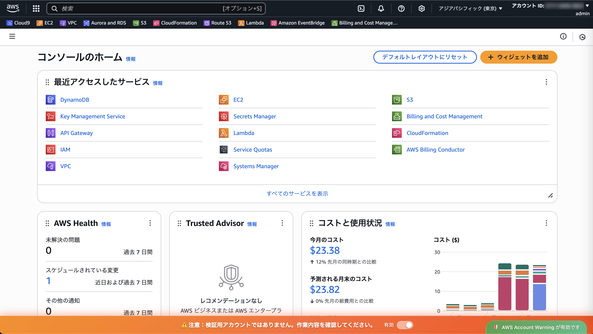
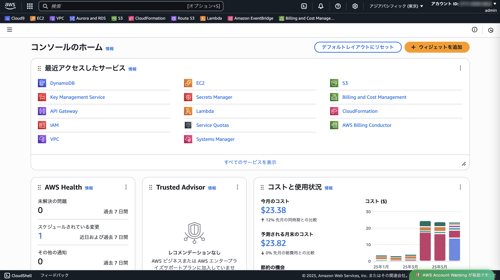
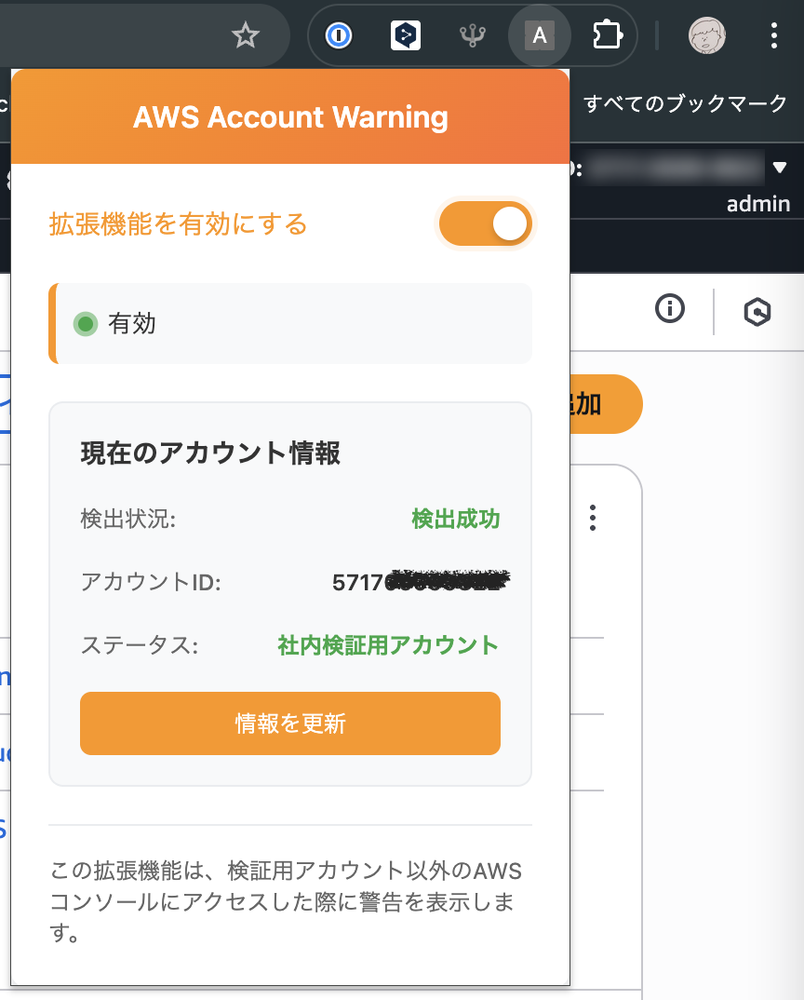

# AWS Account Warning Chrome 拡張機能



AWS マネジメントコンソールで特定のアカウント（社内の検証用アカウント）以外にアクセスした際に、他のアカウントと間違って作業しないように警告を表示する Chrome 拡張機能です。

## サンプル画面

### 特定のアカウント利用時表示



### 設定画面



## 主要機能

### 1. アカウント監視・警告機能

- AWS コンソール（console.aws.amazon.com）でのみ動作
- `freeTierNotOkay`クラスの要素からアカウント ID を自動取得
- 検証用アカウント以外の場合にフッターに警告を表示
- オレンジ色をベースにしたグラデーションのモダンなデザイン
- 警告内のトグルスイッチで拡張機能の有効/無効を切り替え
- ポップアップのトグルスイッチと完全連動

### 2. ポップアップ制御機能

- 拡張機能アイコンをクリックしてポップアップを表示
- トグルスイッチで拡張機能の有効/無効を切り替え
- 現在のアカウント情報をリアルタイム表示
  - 検出状況（成功/失敗）
  - アカウント ID
  - ステータス（検証用/本番）
- 「情報を更新」ボタンで最新情報を取得
- モダンな UI デザイン（オレンジのグラデーション）

### 3. フッタ表示機能

- 拡張機能が有効な場合、画面右下に緑色のフッタを表示
- 「🛡️ AWS Account Warning が有効です」メッセージ
- アニメーション効果とホバー効果
- 拡張機能が無効の場合は自動的に非表示

## セットアップ手順

### 1. 検証用アカウント ID の設定

`content.js`ファイルの`VALID_ACCOUNT_IDS`配列に、検証用のアカウント ID を設定してください：

```javascript
const VALID_ACCOUNT_IDS = [
  "121212121212", // 実際の検証用アカウントIDを設定
  // 必要に応じて複数のアカウントIDも設定可能
];
```

### 2. Chrome 拡張機能としてインストール

1. Chrome ブラウザで `chrome://extensions/` にアクセス
2. 右上の「デベロッパーモード」を有効にする
3. 「パッケージ化されていない拡張機能を読み込む」をクリック
4. このプロジェクトのフォルダを選択

## 使用方法

### 基本操作

1. 拡張機能をインストール後、AWS コンソール（console.aws.amazon.com）にアクセス
2. 拡張機能アイコンをクリックしてポップアップを開く
3. ポップアップのトグルスイッチで機能の有効/無効を切り替え
4. 「現在のアカウント情報」セクションでアカウント状況を確認

### 2 つのトグルスイッチ

拡張機能には 2 つのトグルスイッチがあり、どちらも同じ機能を制御します：

1. **ポップアップのトグルスイッチ**: 拡張機能アイコンをクリックして表示されるポップアップ内
2. **警告のトグルスイッチ**: 警告が表示された際に警告内に表示される

両方のトグルスイッチは完全に連動しており、どちらを操作しても同じ結果になります。

### 警告機能

1. 検証用アカウント以外のアカウントにアクセスすると、画面下部に警告が表示されます
2. 警告内のトグルスイッチ（「有効」）で拡張機能の有効/無効を切り替えできます
3. トグルを無効にすると警告が非表示になり、拡張機能全体が無効化されます
4. ポップアップのトグルスイッチと完全に連動しており、どちらからでも制御可能です

### フッタ表示

- 拡張機能が有効な場合、画面右下に「🛡️ AWS Account Warning が有効です」が表示されます
- 無効にするとフッタも自動的に非表示になります

## ファイル構成

```
chrome-extension-aws-account-view/
├── manifest.json      # 拡張機能の設定ファイル
├── content.js         # メインの機能を実装したスクリプト
├── styles.css         # 警告表示のスタイル
├── popup.html         # ポップアップのHTML
├── popup.css          # ポップアップのスタイル
├── popup.js           # ポップアップの動作スクリプト
├── icon.svg           # 拡張機能のアイコン
└── README.md          # このファイル
```

## 技術仕様

- **Manifest Version**: 3
- **対応ブラウザ**: Chrome
- **動作 URL**:
  - `*://console.aws.amazon.com/*`
  - `*://*.console.aws.amazon.com/*`
  - `*://*.amazonaws.com/*`
- **アカウント ID 抽出**: `freeTierNotOkay`クラスの要素から抽出
- **DOM 監視**: MutationObserver を使用してリアルタイム監視
- **ストレージ**: Chrome Storage API を使用した設定保存
- **メッセージ通信**: Content Script と Popup 間の双方向通信

## 機能詳細

### アカウント検出機能

拡張機能は以下の方法で AWS アカウント ID を検出します：

1. `freeTierNotOkay`クラスを持つ DOM 要素を監視
2. 該当要素のテキストから 12 桁のアカウント ID を抽出
3. 検出したアカウント ID を検証用アカウントリストと照合
4. 結果に応じて警告表示/非表示を制御

### ポップアップ機能

- **有効/無効切り替え**: トグルスイッチで拡張機能の動作を制御
- **アカウント情報表示**:
  - 検出状況: 成功（緑）/失敗（赤）
  - アカウント ID: 検出された ID、または「未検出」
  - ステータス: 検証用（緑）/本番（赤）
- **リアルタイム更新**: 「情報を更新」ボタンで最新状態を取得

### 警告トグルスイッチ機能

- **統合制御**: 警告内のトグルスイッチでも拡張機能の有効/無効を制御可能
- **完全連動**: ポップアップと警告のトグルスイッチが完全に同期
- **センター配置**: 警告メッセージとトグルスイッチが美しくセンター配置
- **レスポンシブ対応**: デスクトップでは横並び、モバイルでは縦並びレイアウト
- **Chrome Storage 連携**: 設定変更は自動的に保存され、ブラウザ再起動後も維持

## カスタマイズ

### 警告メッセージの変更

`content.js`の`WARNING_MESSAGE`定数を変更することで、警告メッセージをカスタマイズできます：

```javascript
const WARNING_MESSAGE =
  "⚠️ 注意：検証用アカウントではありません。作業内容を確認してください。";
```

### デザインの変更

- `styles.css`: 警告の見た目をカスタマイズ
- `popup.css`: ポップアップの見た目をカスタマイズ

### 検証用アカウントの追加

`content.js`の`VALID_ACCOUNT_IDS`配列に複数のアカウント ID を追加できます：

```javascript
const VALID_ACCOUNT_IDS = [
  "121212121212", // 検証用アカウント1
  "343434343434", // 検証用アカウント2
  // 必要に応じて追加
];
```

## トラブルシューティング

### 警告が表示されない場合

1. ブラウザの開発者ツール（F12）でコンソールを確認
2. 拡張機能が正しくインストールされているか確認
3. AWS コンソールの URL が対応範囲内か確認
4. `freeTierNotOkay`クラスの要素が存在するか確認
5. ポップアップまたは警告のトグルスイッチで拡張機能が有効になっているか確認

### アカウント ID が正しく認識されない場合

1. ブラウザの開発者ツールでコンソールログを確認
2. ポップアップの「現在のアカウント情報」で検出状況を確認
3. `VALID_ACCOUNT_IDS`の設定を確認
4. 「情報を更新」ボタンで最新情報を取得

### ポップアップが開かない場合

1. 拡張機能が正しくインストールされているか確認
2. `chrome://extensions/` で拡張機能が有効になっているか確認
3. ブラウザを再起動してみる

### フッタが表示されない場合

1. ポップアップまたは警告のトグルスイッチで拡張機能が有効になっているか確認
2. ブラウザの開発者ツールでコンソールエラーを確認
3. ページを再読み込みしてみる

### 警告のトグルスイッチが反応しない場合

1. ページを再読み込みしてコンテンツスクリプトを再初期化
2. ブラウザの開発者ツールで JavaScript エラーを確認
3. 拡張機能を一度無効にして再度有効にする
4. Chrome 拡張機能ページで拡張機能を再読み込み

## 開発者向け情報

### メッセージ通信

Content Script と Popup 間では以下のメッセージでやり取りします：

- `toggleExtension`: 拡張機能の有効/無効切り替え
- `getAccountInfo`: 現在のアカウント情報取得

### ストレージ

Chrome Storage Sync API を使用して以下の設定を保存：

- `extensionEnabled`: 拡張機能の有効/無効状態

## ライセンス

このプロジェクトは MIT ライセンスの下で公開されています。
